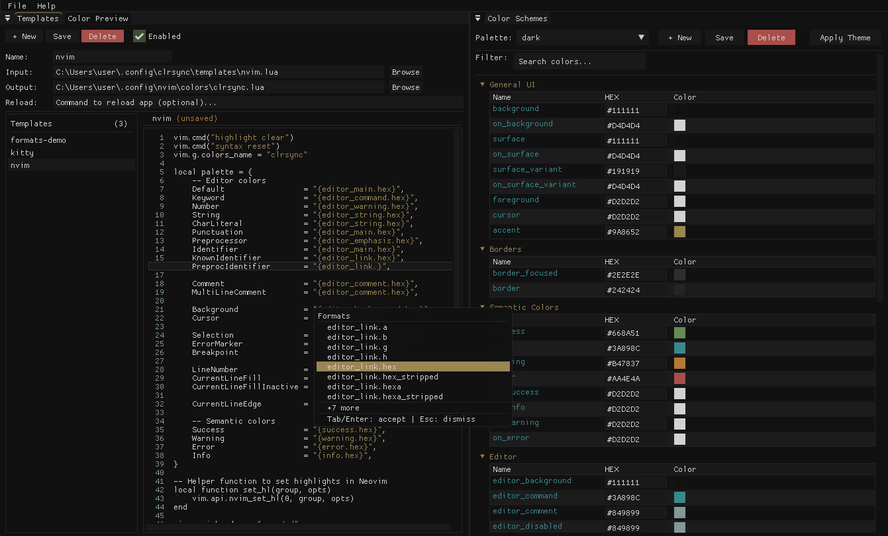

[](https://opensource.org/licenses/MIT)
[](https://nixos.wiki/wiki/Flakes)

# clrsync

**Notice:** This application is not yet released and is subject to change.  

A theme management tool for synchronizing color schemes across multiple applications. clrsync allows to define color palettes once and apply them consistently to all configurable applications.



## Table of Contents


- [Features](#features)
- [Installation](#installation)
  - [Linux](#linux)
    - [Ubuntu](#ubuntu)
    - [Fedora](#fedora)
    - [NixOS](#nixos)
      - [Home Manager Module](#home-manager-module)
      - [Package](#package)
      - [Install to profile](#install-to-profile)
      - [Run without installing](#run-without-installing)
  - [Windows](#windows)
  - [Other systems](#other-systems)
- [Building](#building)
  - [Prerequisites](#prerequisites)
  - [With CMake](#with-cmake)
- [Configuration](#configuration)
  - [Palette Files](#palette-files)
  - [Template Files](#template-files)
    - [Color Format Specifiers](#color-format-specifiers)
- [Usage](#usage)
  - [CLI](#cli)
  - [GUI](#gui)
- [Acknowledgments](#acknowledgments)

## Features

- **Unified Color Management**: Define color palettes in TOML format and apply them across multiple applications
- **CLI & GUI**: Choose between a command-line interface or a graphical editor
- **Live Reload**: Define post-apply hooks (configurable per template)
- **Flexible Color Formats**: Support for HEX, RGB, HSL with multi-component access (e.g., `{color.r}`, `{color.hex}`, `{color.hsl}`)

## Installation

### Linux

#### Ubuntu

1. Download the latest .deb from the [releases page](https://github.com/obsqrbtz/clrsync/releases)
2. Install the package

```shell
sudo dpkg -i clrsync-<version>.deb
```

#### Fedora

1. Download the latest .rpm from the [releases page](https://github.com/obsqrbtz/clrsync/releases)

2. Install the package

```shell
sudo rpm -i clrsync-<version>.rpm

# or

sudo dnf install clrsync-<version>.rpm
```

#### NixOS

<details>
<summary>Home Manager Module</summary>

1. Add clrsync to your flake inputs

```nix
{
  inputs = {
    nixpkgs.url = "github:NixOS/nixpkgs/nixos-unstable";
    home-manager.url = "github:nix-community/home-manager";
    
    clrsync.url = "github:obsqrbtz/clrsync";
  };
}
```

2. Add clrsync to flake outputs

```nix
outputs =
  {
    self,
    nixpkgs,
    home-manager,
    clrsync,
    ...
  }@inputs:
  let
    system = "x86_64-linux";
    pkgs = nixpkgs.legacyPackages.${system};
  in
  {
    # ...
    homeConfigurations.<Your user name> = home-manager.lib.homeManagerConfiguration {
      inherit pkgs;
      extraSpecialArgs = { inherit inputs; };
      modules = [
        ./home.nix
        clrsync.homeModules.default
      ];
    };
  };
```

3. Configure in home manager

```nix
programs.clrsync = {
  package = inputs.clrsync.packages.x86_64-linux.default;  
  defaultTheme = "dark";
  palettesPath = "~/.config/clrsync/palettes";
  font = "JetBrainsMono Nerd Font Mono";
  fontSize = 14;
  applyTheme = true;

  templates = {
    kitty = {
      enabled = true;
      inputPath = "~/.config/clrsync/templates/kitty.conf";
      outputPath = "~/.config/kitty/clrsync.conf";
      reloadCmd = "pkill -SIGUSR1 kitty";
    };
    
    rofi = {
      enabled = true;
      inputPath = "~/.config/clrsync/templates/rofi.rasi";
      outputPath = "~/.config/rofi/clrsync.rasi";
    };
  };
};
```

4. Rebuild

```nix
home-manager switch --flake .
```

</details>

<details>
<summary>Package</summary>

1. Add clrsync to your flake inputs

```nix
{
  inputs = {
    clrsync.url = "github:obsqrbtz/clrsync";
  };
}
```

2. Install the package

```nix
# In NixOS configuration.nix:
nixpkgs.overlays = [
  inputs.clrsync.overlays.default
];

environment.systemPackages = [
  clrsync
];
```

Or for home manager:

```nix
# flake.nix
pkgs = import nixpkgs {
  inherit system;
  overlays = [
    clrsync.overlays.default
  ];
};
```

```nix
# home.nix
home.packages = [
  clrsync
];
```

3. Use the app manually

```shell
clrsync_gui

# or
clrsync_cli --apply --theme dark
```

</details>

<details>
<summary>Install to profile</summary>

```shell
nix profile add github:obsqrbtz/clrsync
```

</details>

<details>
<summary>Run without installing</summary>

```shell
nix run github:obsqrbtz/clrsync
nix run github:obsqrbtz/clrsync#clrsync-cli
```

</details>

### Windows

1. Download the latest installer from the [releases page](https://github.com/obsqrbtz/clrsync/releases)
2. Run the installer and follow the wizard
3. Optionally, add the installation dir to your PATH for easier CLI access

### Other systems

Follow the steps from Building section then install with cmake:
```bash
cd build
cmake --install .
```

## Building

### Prerequisites

- C++20 compatible compiler (GCC, Clang, or MSVC)
- CMake
- OpenGL
- glfw
- fontconfig
- freetype

### With CMake
```bash
mkdir build && cd build
cmake ..
cmake --build .
```

## Configuration

Edit or create a configuration file at `~/.config/clrsync/config.toml`:
```toml
[general]
palettes_path = "~/.config/clrsync/palettes"
default_theme = "cursed"

[templates.kitty]
input_path = "~/.config/clrsync/templates/kitty.conf"
output_path = "~/.config/kitty/clrsync.conf"
enabled = true
reload_cmd = "pkill -SIGUSR1 kitty"
```

### Palette Files

<details>
<summary>Example palette file</summary>

Create palette files in your `palettes_path` directory:
```toml
# ~/.config/clrsync/palettes/dark.toml
[general]
name = 'cursed'

[colors]
accent = '#B44242FF'
background = '#151515FF'
base00 = '#151515FF'
base01 = '#B44242FF'
base02 = '#95A328FF'
base03 = '#E1C135FF'
base04 = '#60928FFF'
base05 = '#7C435AFF'
base06 = '#A48B4AFF'
base07 = '#C2C2B0FF'
base08 = '#3F3639FF'
base09 = '#DC7671FF'
base0A = '#E8E85AFF'
base0B = '#9E9052FF'
base0C = '#76C39BFF'
base0D = '#86596CFF'
base0E = '#CEB34FFF'
base0F = '#B0AFA8FF'
border = '#3F3639FF'
border_focused = '#E1C135FF'
cursor = '#E1C135FF'
editor_background = '#151515FF'
editor_command = '#CEB34FFF'
editor_comment = '#3F3639FF'
editor_disabled = '#3F3639FF'
editor_emphasis = '#DC7671FF'
editor_error = '#B44242FF'
editor_inactive = '#3F3639FF'
editor_line_number = '#86596CFF'
editor_link = '#60928FFF'
editor_main = '#C2C2B0FF'
editor_selected = '#3F3639FF'
editor_selection_inactive = '#2A2A2AFF'
editor_string = '#76C39BFF'
editor_success = '#95A328FF'
editor_warning = '#E1C135FF'
error = '#B44242FF'
foreground = '#C2C2B0FF'
info = '#60928FFF'
on_background = '#C2C2B0FF'
on_error = '#151515FF'
on_info = '#151515FF'
on_success = '#151515FF'
on_surface = '#C2C2B0FF'
on_surface_variant = '#C2C2B0FF'
on_warning = '#151515FF'
success = '#95A328FF'
surface = '#1C1C1CFF'
surface_variant = '#1C1C1CFF'
warning = '#E1C135FF'
```

</details>

### Template Files

<details>
<summary>Example template file</summary>

Create template files at `~/.config/clrsync/templates` using color variables:
```conf
# ~/.config/clrsync/templates/kitty.conf
cursor              {cursor}
cursor_text_color   {background}
foreground            {foreground}
background            {background}
selection_foreground  {on_surface}
selection_background  {surface}
url_color             {accent}
color0      {base00}
color8      {base08}
color1      {base01}
color9      {base09}
color2      {base02}
color10     {base0A}
color3      {base03}
color11     {base0B}
color4      {base04}
color12     {base0C}
color5      {base05}
color13     {base0D}
color6      {base06}
color14     {base0E}
color7      {base07}
color15     {base0F}
```

</details>

<details>
<summary>Color Format Specifiers</summary>

Format colors using dot notation:
```conf
# HEX formats
{color}                    # Default: #RRGGBB
{color.hex}                # #RRGGBB
{color.hex_stripped}       # RRGGBB
{color.hexa}               # #RRGGBBAA
{color.hexa_stripped}      # RRGGBBAA

# RGB components (0-255)
{color.rgb}                # rgb(r, g, b)
{color.r}                  # Red component
{color.g}                  # Green component
{color.b}                  # Blue component

# RGBA (alpha normalized 0-1)
{color.rgba}               # rgba(r, g, b, a)
{color.a}                  # Alpha component

# HSL (hue 0-360, saturation/lightness 0-1)
{color.hsl}                # hsl(h, s, l)
{color.h}                  # Hue component
{color.s}                  # Saturation component
{color.l}                  # Lightness component

# HSLA (hue 0-360, saturation/lightness/alpha 0-1)
{color.hsla}               # hsla(h, s, l, a)
{color.a}                  # Alpha component
```

</details>

## Usage

### CLI

List available themes:
```bash
clrsync_cli --list-themes
```

Apply the default theme:
```bash
clrsync_cli --apply
```

Apply a specific theme:
```bash
clrsync_cli --apply --theme cursed
```

Apply a theme from a file path:
```bash
clrsync_cli --apply --path /path/to/theme.toml
```

Show available color variables:
```bash
clrsync_cli --show-vars
```

Use a custom config file:
```bash
clrsync_cli --config /path/to/config.toml --apply
```

### GUI

Launch the graphical editor:
```bash
clrsync_gui
```

The GUI provides:

- **Color Scheme Editor**: Visual palette editor with color pickers
- **Template Editor**: Edit template files
- **Live Preview**: See changes in real-time

## Acknowledgments

- **[matugen](https://github.com/InioX/matugen)** - A material you color generation tool
- **[Dear ImGui](https://github.com/ocornut/imgui)** - Bloat-free graphical user interface library for C++
- **[GLFW](https://www.glfw.org/)** - Multi-platform library for OpenGL, OpenGL ES and Vulkan development
- **[toml++](https://github.com/marzer/tomlplusplus)** - Header-only TOML config file parser and serializer for C++17
- **[argparse](https://github.com/p-ranav/argparse)** - Argument Parser for Modern C++
- **[ImGuiColorTextEdit](https://github.com/BalazsJako/ImGuiColorTextEdit)** - Syntax highlighting text editor for ImGui
- **cursed** by **[pyratebeard](https://pyratebeard.net)** - Color scheme