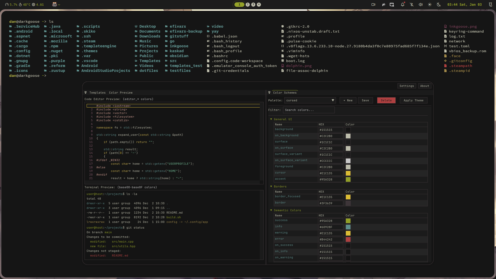
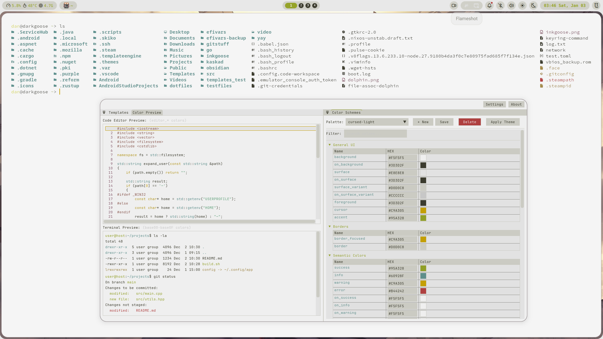
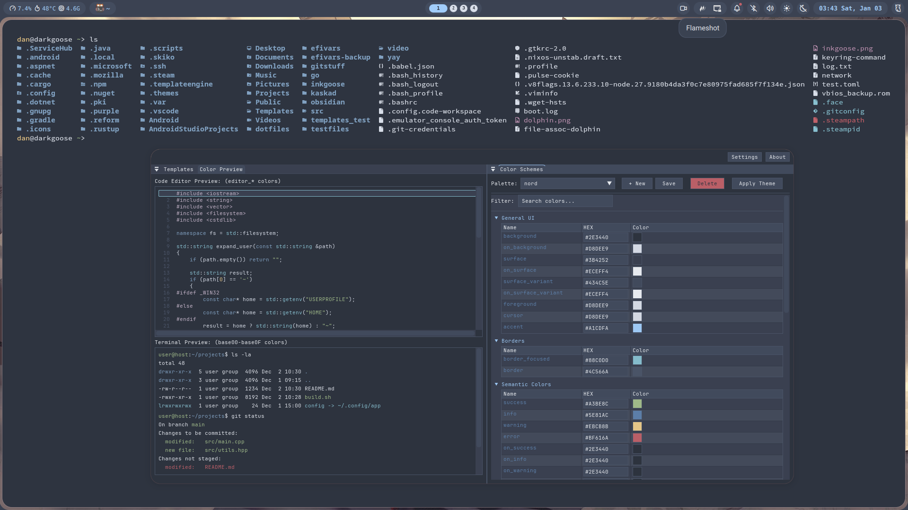

# Extras

## Palettes

### Cursed

A dark color scheme, which tries to be like `cursed` theme by **[pyratebeard](https://pyratebeard.net)** 



### Cursed-light

Same as `cursed`, but it also tries to be light as well



### Nord

Color scheme based on `Nord`



## Pre-configured templates

### Kitty

**1. Download [template file](templates/kitty.conf)**

**2. Configure template in `~/.config/clrsync/config.toml`**

```toml
[templates.kitty]
enabled = true
input_path = '~/.config/clrsync/templates/kitty.conf'
output_path = '~/.config/kitty/clrsync.conf'
reload_cmd = 'pkill -SIGUSR1 kitty'
```

**3. Import generated color scheme in `~/.config/kitty/kitty.conf**

```conf
include clrsync.conf
```

### Neovim

**1. Download [template file](templates/nvim.lua)**

**2. Configure template in `~/.config/clrsync/config.toml`**

```toml
[templates.nvim]
enabled = true
input_path = '~/.config/clrsync/templates/nvim.lua'
output_path = '~/.config/nvim/colors/clrsync.lua'
reload_cmd = ''
```

**3. Set colorscheme in neovim config**

```lua
vim.cmd.colorscheme 'clrsync'
```

### Alacritty

**1. Download [template file](templates/alacritty.toml)**

**2. Configure template in `~/.config/clrsync/config.toml`**

```toml
[templates.alacritty]
enabled = true
input_path = '~/.config/clrsync/templates/alacritty.toml'
output_path = '~/.config/alacritty/clrsync.toml'
reload_cmd = ''
```

**3. Import generated color scheme in `~/.config/alacritty/alacritty.toml**

```toml
[general]
import = ["clrsync.toml"]
```


### Ghostty

**1. Download [template file](templates/ghostty)**

**2. Configure template in `~/.config/clrsync/config.toml`**

```toml
[templates.ghostty]
enabled = true
input_path = '~/.config/clrsync/templates/ghostty'
output_path = '~/.config/ghostty/themes/clrsync'
reload_cmd = 'pkill -SIGUSR2 ghostty'
```

**3. Set generated color scheme in `~/.config/ghostty/config**

```toml
theme = "clrsync"
```