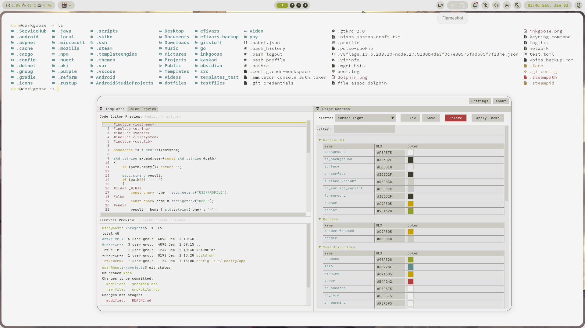

# Extras

Pre-configured palettes and templates for clrsync.

## Palettes

| Palette | Preview |
|---------|---------|
| [Nord](palettes/dark/nord) |  |
| [Cursed](palettes/dark/cursed) |  |
| [Cursed Light](palettes/light/cursed-light) |  |

## Templates

### Terminals
- [Alacritty](templates/terminals/alacritty)
- [Ghostty](templates/terminals/ghostty)
- [Kitty](templates/terminals/kitty)

### Text Editors
- [Neovim](templates/text-editors/neovim)
- [VS Code](templates/text-editors/vscode)

### Browsers
- [Firefox](templates/browsers/firefox)

### Desktop
- [GTK](templates/desktop/gtk)
- [Qt](templates/desktop/qt)

### Window Managers
- [Hyprland](templates/wms/hyprland)

### Apps
- [Telegram](templates/apps/telegram)

## Contributing

To add a new palette:

1. Create a folder in `palettes/<dark/light>` with your palette name
2. Add your `.toml` palette file
3. Add a `readme.md` with description
4. Add a screenshot (`.png`)
5. Submit a PR

To add a new template:

1. Create a folder in `templates/<category>` with the app name
2. Add your template file(s)
3. Add a `readme.md` with installation instructions
4. Submit a PR
